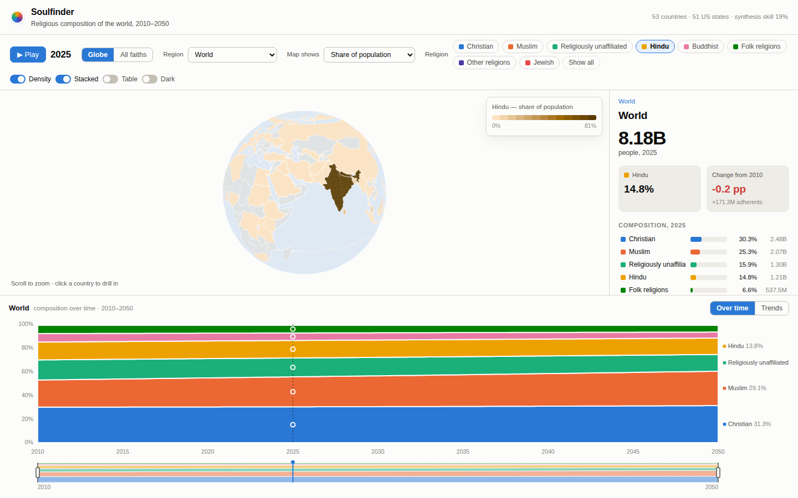
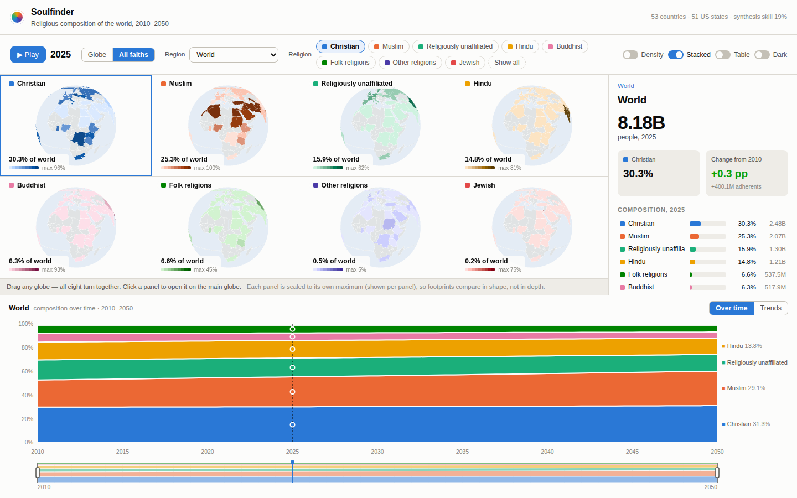
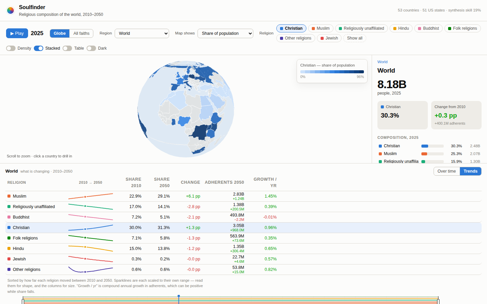

# Soulfinder

Religious composition of the world, 2010–2050 — an interactive globe, a
scrubbable time-series chart, and a pipeline that synthesises the subnational
detail nobody publishes.



---

## What it does

**An interactive globe** that flattens into a map as you zoom. Countries are
shaded by one religion's share of the population, or by how that share has
changed since a baseline year. Selecting a religion recolours the whole map in
that religion's own hue — choropleth, heat layer and legend together — so
switching faiths reads as switching subject. Zoom into the United States and
the same view drills into all 51 states.

**A sliding time-series chart** underneath, showing the composition of whatever
region is selected. Drag the playhead to scrub through years; drag the range
brush to zoom the time axis; the globe follows. World, country and state all
use the same chart — they are the same data type at different levels.

**An atlas of all eight faiths at once** — one globe per religion, sharing a
single camera, so dragging any one of them turns all eight. Each is a
sequential ramp built from that religion's chart colour, which is what makes
showing all eight simultaneously colour-safe (see below).



**A trend rail** that answers *what is changing* rather than *what is there*:
every religion on its own baseline with a sparkline, sorted by how far it
moved, with change in both percentage points and adherents, plus compound
annual growth. Muslim +6.1 pp to 2050; Unaffiliated −2.8 pp yet **+200M
people** — the two figures point in opposite directions, and the rail shows
both rather than picking one.



**A dasymetric heat layer** that redistributes each region's adherents onto a
population surface anchored on real city coordinates, so the heat map tracks
where people actually live rather than where the borders are.

**Provenance on every number.** Each cell is flagged `observed`,
`interpolated`, `modeled` or `synthetic`, and modelled cells carry a credible
interval. The app never shows an estimate about someone's faith without saying
it is an estimate.

---

## Quickstart

```bash
# 1. data pipeline (Python 3.11+)
cd pipeline
pip install -r requirements.txt

# 2. geometry + data artifacts, then the app
cd ../web
npm install
npm run data        # build-geo.mjs, then python -m soulfinder.build
npm run dev         # http://localhost:5173
```

`npm run data` is the whole build: it converts the bundled Natural Earth and US
Census TopoJSON to GeoJSON, then runs the Python pipeline to produce
`web/public/data/`. Generated artifacts are gitignored — the pipeline is the
source of truth.

```bash
cd pipeline && python3 -m pytest      # 64 tests
cd web && npm run build               # typecheck + production bundle
```

---

## Layout

```
pipeline/                 the data layer — a tested Python package, not a script
  sources/*.csv           seed data (see sources/README.md)
  soulfinder/
    compositional.py      ALR/CLR transforms, Aitchison distance, zero replacement
    interpolate.py        decadal knots -> per-year frames (shape-preserving)
    benchmark.py          splices two instruments that disagree
    downscale.py          the four-stage subnational synthesis
    ipf.py                raking; the guarantee that models never move totals
    spatial.py            k-nearest spatial weights, Laplacian smoothing
    dasymetric.py         polygon totals -> population surface
    validate.py           k-fold CV against a national-average baseline
    build.py              orchestrator -> web/public/data/
  tests/                  64 tests, including end-to-end hierarchy invariants

web/
  scripts/build-geo.mjs   TopoJSON -> GeoJSON + centroids
  src/components/         GlobeMap, TimeSeries, RangeBrush, RegionPanel, ...
  src/lib/palette.ts      validated categorical / sequential / diverging ramps
```

---

## Why the map never colours countries *by* religion

The obvious design — shade each country by its largest religion — cannot be
made colour-safe. On a map any two religions can end up adjacent, so the
palette must clear separation floors on all 28 pairs, not the 7 that a chart
needs. Testing every subset of the validated eight-hue order, in both themes:
**no subset of 5 or more passes**, and neither of the two passing 4-hue sets
contains the hues already bound to Muslim or Unaffiliated. A categorical map
would have to recolour religions relative to the chart.

So the app facets instead. Each religion gets its own **sequential** ramp,
generated from its categorical hue in OKLab — which is why all eight can be
shown at once in the atlas, and why picking a religion recolours the main globe
rather than adding a hue to it. Details and the ramp-generation maths are in
[docs/ARCHITECTURE.md](docs/ARCHITECTURE.md).

## How good is the synthetic data?

Only the US has observed state-level religion data, so it is the test bed.
5-fold cross-validation hides a fold's states and predicts them from covariates
alone, exactly as an unmeasured country's provinces would be predicted.

| | Model | Baseline (assume every state = national average) |
|---|---|---|
| Total variation distance | **0.0616** | 0.0760 |
| Aitchison distance | **1.249** | 1.483 |
| **Skill** | **+18.8% of baseline error removed** | — |

Mean absolute error is 5.2 pp on the Christian share and 4.2 pp on the
unaffiliated share — the two largest categories, and not a small error. That is
the honest cost of estimating something nobody measured, and it is why the
synthetic cells are labelled and carry intervals.

The finding that most shaped the pipeline: the national and subnational sources
are different instruments that **disagree by 6.4 points** on the US Christian
share. Raking state estimates to the unreconciled national marginal scores
**−15.9% skill** — worse than assuming every state is average. Benchmarking the
two series before raking is what turns the model from harmful to useful. Full
detail in [docs/METHODOLOGY.md](docs/METHODOLOGY.md).

---

## Data sources

The seed tables in `pipeline/sources/` are **hand-compiled approximations of
publicly reported figures, for prototyping**. They are good enough to exercise
and validate the machinery; they are not citable, and no number in them should
be quoted.

The loaders read the authoritative files unchanged — swapping them in is a file
drop, documented in [`pipeline/sources/README.md`](pipeline/sources/README.md):

- **Pew Research Center** — *Global Religious Landscape*; *Religious Composition
  by Country, 2010–2050*
- **ARDA** — *US Religion Census* (county-level), *Religious Landscape Study*
- **UN World Population Prospects** — population and projections
- **Natural Earth / US Census** — geometry (bundled via npm)
- **WorldPop / GHS-POP** — the population raster that would replace the
  city-anchored density surface

Only 53 countries carry data in this build. The rest render grey and say so.

---

## Docs

- [docs/ARCHITECTURE.md](docs/ARCHITECTURE.md) — stack choices and why, the
  world→country→state model, keeping the visuals honest
- [docs/METHODOLOGY.md](docs/METHODOLOGY.md) — the statistics, the validation,
  and the known limitations
